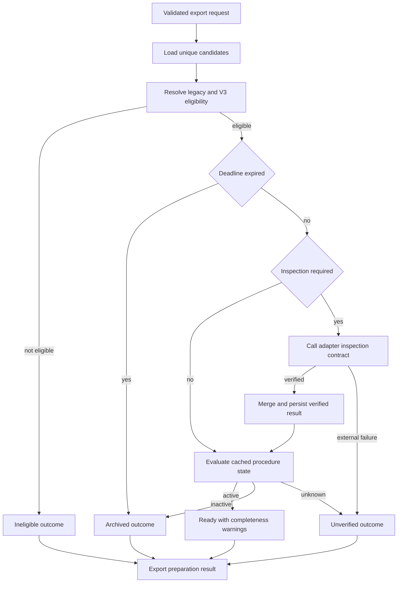

# EI-1 Business Logic Model

## Цель

EI-1 принимает кандидатов из persistence, определяет необходимость live-инспекции,
применяет normalized result и выдаёт EI-3 исчерпывающий partition результатов.
Он не выполняет HTTP/Jinja2/ZIP-операции и не импортирует concrete adapters.

## Основной flow

Текстовая альтернатива: после загрузки и классификационного фильтра просроченный
тендер архивируется. Остальные при необходимости проходят live inspection.
Verified result сохраняется и оценивается; external failure становится
unverified. Финальный результат содержит непересекающиеся outcome-группы.

## Алгоритм подготовки

Для каждого уникального запрошенного ID в стабильном порядке:

1. Если запись отсутствует, добавить `missing` и не выполнять внешний вызов.
2. Получить `V3ExportContext` и вычислить classification eligibility.
3. Если нет V3 P1/P2 и legacy tier не `qualified`, добавить `ineligible`.
4. Если сохранённый дедлайн уже прошёл, добавить `archived`.
5. Вычислить `inspection_required`:
   - отсутствует любое из buyer, deadline, description, published_at;
   - `procedure_checked_at` отсутствует;
   - возраст успешной проверки не меньше 24 часов;
   - procedure state равен `unknown`.
6. Если inspection не требуется, оценить сохранённое состояние.
7. Если требуется, вызвать абстрактный adapter contract.
8. При verified result применить merge и повторно оценить состояние/дедлайн.
9. При external failure сохранить только attempt metadata/error и добавить
   `unverified`; ранее подтверждённое состояние не переписывать.
10. Active result добавить в `ready` вместе с completeness warnings.

## Подтверждение активности

Процедура считается подтверждённо активной, если успешная инспекция обнаружила:

- явный active/open/accepting status; либо
- семантически подтверждённый будущий deadline при отсутствии явного
  противоречащего inactive status.

HTTP 200 без active marker и без будущего deadline недостаточен: state остаётся
`unknown`, export outcome — `unverified`.

## Приоритет решения

1. `not_found` от 404.
2. Явный `cancelled`, `completed` или `closed` source status.
3. Просроченный подтверждённый deadline.
4. Явный active status либо будущий подтверждённый deadline.
5. `unknown`.

Консервативный приоритет не позволяет active marker скрыть просроченный deadline.

## TTL

Успешное подтверждение действительно 24 часа. Проверка свежа, только если
`now - procedure_checked_at < 24h`; ровно на границе 24h она уже stale.
`procedure_last_attempt_at` не участвует в TTL, поскольку неуспешная попытка не
подтверждает active state.

## Merge и повторное открытие

- Непустые buyer, budget, deadline, description и published_at из verified
  inspection заменяют сохранённые значения.
- `null` никогда не стирает сохранённое значение.
- Latest verified procedure state заменяет прежнее, включая inactive → active.
- Workflow `status` не является частью merge и остаётся неизменным.
- Повторное применение идентичного result не меняет observable business data.

## Outcome partition

`ExportPreparationResult` содержит `ready`, `archived`, `unverified`,
`ineligible`, `missing` и summary. Группы непересекаются, каждый уникальный
requested ID находится ровно в одной группе.

## Ошибки

- Unknown platform/contract violation → `unverified`, safe error category.
- Timeout/network/auth/CAPTCHA → `unverified`, не archive.
- Database apply failure → вся операция конкретного кандидата fail-closed как
  `unverified`; неподтверждённые данные не выдаются как ready.
- Ошибка одного кандидата не меняет outcome уже обработанных кандидатов, но
  summary фиксирует failure.
