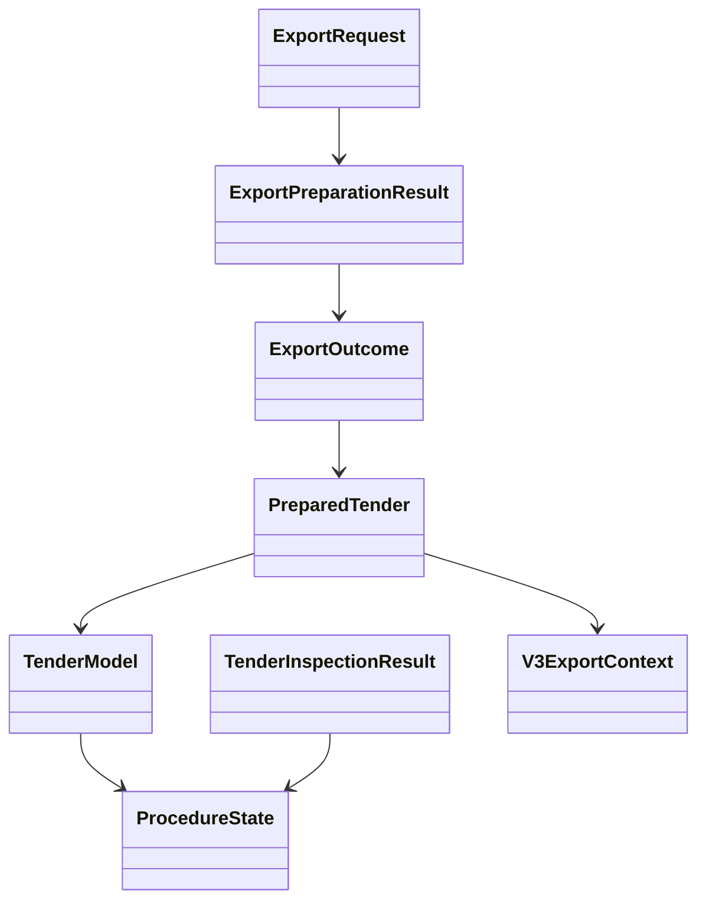

# EI-1 Domain Entities

## `ProcedureState`

Value enum, независимый от `TenderStatus`:

| Value | Смысл | Archive |
|---|---|:---:|
| `unknown` | активность не подтверждена | нет, но export unverified |
| `active` | приём заявок подтверждён | нет, если deadline не просрочен |
| `closed` | приём закрыт | да |
| `completed` | процедура завершена | да |
| `cancelled` | процедура отменена | да |
| `not_found` | detail card вернула 404 | да |

## `TenderModel` extension

| Field | Type | Правило |
|---|---|---|
| `procedure_state` | `ProcedureState` | default `unknown` |
| `procedure_checked_at` | `datetime | None` | timestamp последней successful verification |
| `procedure_last_attempt_at` | `datetime | None` | timestamp любой live attempt |
| `procedure_source` | `str | None` | allowlisted source/mode identifier |
| `procedure_error_category` | `str | None` | safe category последней failed attempt |

Existing `status: TenderStatus` остаётся пользовательским workflow и не связан
переходами с `procedure_state`.

## `TenderInspectionResult`

Immutable typed value object:

| Field | Type | Описание |
|---|---|---|
| `tender_id` | `str` | внутренний ID |
| `procedure_state` | `ProcedureState` | normalized state либо `unknown` |
| `verified` | `bool` | подтверждён ли state source data |
| `attempted_at` | timezone-aware `datetime` | время попытки |
| `source` | enum/string allowlist | API, endpoint, Playwright или detail card |
| enrichment fields | optional typed values | только проверенные значения |
| `raw_data_updates` | bounded dict | provenance namespace |
| `error_category` | safe enum or `None` | failure без чувствительных деталей |

Invariant: `verified=True` несовместим с external `error_category`.

## `V3ExportContext`

Read-only value object с полями verdict, fit_score, confidence, queue,
judge-applied indicator и lookup source. Допустим `None`, если V3 отсутствует.

## `ExportRequest`

| Field | Type | Описание |
|---|---|---|
| `tender_ids` | `tuple[str, ...] | None` | explicit unique IDs либо bulk mode |
| `requested_at` | timezone-aware `datetime` | единый clock для TTL/deadline решений |
| `limit` | bounded positive integer | defense-in-depth batch maximum |

## `PreparedTender`

Содержит refreshed TenderModel, V3 context, inclusion reason и
`completeness_warnings`. Credentials/raw response body отсутствуют.

## `ExportOutcome`

Value object для одного ID:

- category: ready/archived/unverified/ineligible/missing;
- tender ID и platform, если известна;
- safe reason code;
- optional prepared tender только для ready.

## `ExportPreparationResult`

Aggregate с пятью непересекающимися outcome collections и derived summary.
Invariant: каждый unique requested candidate представлен ровно один раз.

## Relationships

Текстовая альтернатива: request создаёт preparation aggregate. Каждый outcome
может содержать prepared tender; prepared tender объединяет persisted tender и
V3 context. Tender и inspection result используют общий ProcedureState.

## Persistence relationship

PostgreSQL хранит TenderModel и procedure metadata. V3ExportContext остаётся
read-only projection из существующего SQLite cache. Export request/outcomes не
персистятся как новые таблицы; auditability обеспечивается structured logs и
обновлёнными procedure timestamps/provenance.
