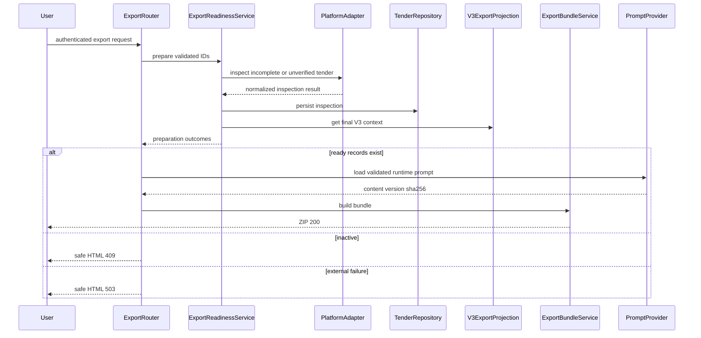

# Application Design — TenderAutomation

## Технологический стек

| Слой | Технология | Обоснование |
|---|---|---|
| Web framework | FastAPI | Async, автодокументация OpenAPI, Jinja2 templates |
| Frontend | Jinja2 (SSR) + minimal JS | Простота, нет отдельного фронтенд-билда |
| Auth | Session-based (cookie) | Надёжно, без токенов, подходит для внутреннего инструмента |
| Database | PostgreSQL | Масштабируемость, надёжные транзакции |
| Append-only logs | JSONL files | Простота, читаемость, экспорт для AI-агента |
| Scheduler | Linux system cron | Независим от веб-процесса, стандарт для Linux VPS |
| Platform interface | ABC (Python ABC module) | Явный контракт, статический анализ, понятно новым разработчикам |
| In-process events | Simple EventBus | Связность pipeline без внешних зависимостей |
| Notifications | python-telegram-bot + smtplib | Стандартные библиотеки |

## Структура проекта

```
TenderAutomation/
├── src/
│   ├── core/                    # Unit 1 — Core Library
│   │   ├── models/
│   │   │   ├── tender.py        # TenderModel, RawTender, ScoredTender
│   │   │   ├── action.py        # TenderAction, AnalysisResult
│   │   │   └── platform.py      # PlatformDescriptor, PlatformCredentials, AuthSession
│   │   ├── adapters/
│   │   │   └── base.py          # PlatformAdapter ABC
│   │   ├── repositories/
│   │   │   ├── tender.py        # TenderRepository
│   │   │   ├── qualified_log.py # QualifiedLogRepository
│   │   │   └── action_log.py    # ActionLogRepository
│   │   ├── services/
│   │   │   ├── collection.py    # CollectionService
│   │   │   ├── qualification.py # QualificationService + QualificationEngine
│   │   │   └── pipeline.py      # PipelineOrchestrator
│   │   ├── events/
│   │   │   └── bus.py           # EventBus
│   │   └── cli.py               # Entry point: python -m core.cli run-pipeline
│   │
│   ├── adapters/                # Unit 2 — Platform Adapters
│   │   ├── registry.py          # AdapterRegistry
│   │   ├── b2bcenter/
│   │   │   ├── adapter.py       # B2BCenterAdapter
│   │   │   └── descriptor.yaml  # B2B-Center platform descriptor
│   │   └── bidzaar/
│   │       ├── adapter.py       # BidzaarAdapter
│   │       └── descriptor.yaml  # Bidzaar platform descriptor
│   │
│   ├── web/                     # Unit 3 — Web Application
│   │   ├── app.py               # FastAPI app factory
│   │   ├── auth.py              # SessionAuth
│   │   ├── routers/
│   │   │   ├── tenders.py       # TenderRouter
│   │   │   ├── actions.py       # ActionRouter
│   │   │   └── history.py       # HistoryRouter
│   │   ├── services/
│   │   │   └── export.py        # ExportService
│   │   └── templates/           # Jinja2 templates
│   │       ├── base.html
│   │       ├── tenders/
│   │       └── history/
│   │
│   └── notifications/           # Unit 4 — Notification Service
│       ├── handler.py           # NotificationHandler
│       ├── telegram.py          # TelegramNotifier
│       ├── email_digest.py      # EmailDigest
│       └── cli.py               # Entry point: python -m notifications.cli send-digest
│
├── AGENTS.md                    # LLM-agnostic инструкция для AI-агентов
├── platforms/                   # Дополнительные YAML-дескрипторы площадок
├── filters/
│   └── keywords.yaml            # Keyword-фильтры квалификации
├── data/                        # Runtime data (gitignored)
│   ├── tenders.jsonl            # Лог квалифицированных тендеров
│   └── actions.jsonl            # Лог действий специалистов
├── .env                         # Секреты (gitignored)
├── requirements.txt
└── pyproject.toml
```

## Компоненты по unit'ам

### Unit 1: Core Library
| Компонент | Тип | Назначение |
|---|---|---|
| TenderModel | Pydantic model | Унифицированное представление тендера |
| PlatformAdapter | ABC | Контракт для адаптеров площадок |
| PlatformDescriptor | Pydantic model | Конфигурация площадки из YAML |
| QualificationEngine | Stateless service | Tier 1 keyword-скоринг |
| TenderRepository | Repository | CRUD PostgreSQL |
| QualifiedLogRepository | Repository | Append-only JSONL |
| ActionLogRepository | Repository | Append-only JSONL |
| EventBus | In-process pub/sub | Связь pipeline → notifications |
| CollectionService | Service | Оркестрация сбора |
| QualificationService | Service | Оркестрация квалификации |
| PipelineOrchestrator | Service | Полный цикл (cron entry point) |

### Unit 2: Platform Adapters
| Компонент | Тип | Назначение |
|---|---|---|
| B2BCenterAdapter | Concrete adapter | HTML-скрейпинг B2B-Center |
| BidzaarAdapter | Concrete adapter | JSON API Bidzaar |
| AdapterRegistry | Registry | Загрузка дескрипторов и адаптеров |

### Unit 3: Web Application
| Компонент | Тип | Назначение |
|---|---|---|
| FastAPIApp | Application | Инициализация, middleware, роутеры |
| SessionAuth | Middleware + dep | Cookie-based аутентификация |
| TenderRouter | Router | Список, карточка, просмотр |
| ActionRouter | Router | Решения специалиста, AI-анализ |
| HistoryRouter | Router | История тендеров |
| ExportService | Service | JSONL + AGENTS.md для скачивания |

### Unit 4: Notification Service
| Компонент | Тип | Назначение |
|---|---|---|
| NotificationHandler | Event subscriber | Слушает EventBus |
| TelegramNotifier | Notifier | Telegram Bot API |
| EmailDigest | Notifier | SMTP email дайджест |

## Ключевые архитектурные решения

1. **Два процесса**: pipeline (cron) и web (gunicorn) разделены. PostgreSQL — общее хранилище.

2. **Cron + in-process events**: cron запускает единый Python-скрипт (`python -m core.cli run-pipeline`). Внутри одного процесса: сбор → квалификация → EventBus → Telegram. Email-дайджест — отдельный cron job раз в сутки.

3. **Bring-your-own-AI**: система не вызывает LLM. Специалист скачивает JSONL + AGENTS.md, использует свой инструмент (claude.ai, ChatGPT и др.), опционально загружает результат в карточку.

4. **Platform extensibility**: новая площадка = YAML-дескриптор + класс-наследник PlatformAdapter. Core не изменяется.

5. **Security**: все секреты в `.env`. PostgreSQL — единственное состояние. JSONL — append-only, нет возможности удалить записи из приложения.

## Потоки данных (сводка)

```
CRON (каждые N часов):
  python -m core.cli run-pipeline
  → Collect [B2BCenter, Bidzaar] → PostgreSQL
  → Qualify → PostgreSQL + tenders.jsonl
  → EventBus → Telegram notification

CRON (раз в сутки):
  python -m notifications.cli send-digest
  → PostgreSQL → Email digest → SMTP

WEB (постоянно):
  Browser ← FastAPI (gunicorn) ← PostgreSQL
  Specialist: view tenders → download JSONL+AGENTS.md
           → [own AI tool] → upload analysis result → PostgreSQL
           → record decision → PostgreSQL + actions.jsonl
```

## Детальные артефакты

- [components.md](components.md) — компоненты и их ответственности
- [component-methods.md](component-methods.md) — сигнатуры методов
- [services.md](services.md) — сервисный слой и оркестрация
- [component-dependency.md](component-dependency.md) — зависимости и потоки данных

---

# Application Design — Export Integrity

## Утверждённые решения

1. `procedure_state` является отдельным persisted field и не заменяет
   пользовательский `TenderStatus`.
2. Runtime-инструкция экспорта хранится в versioned asset
   `prompts/tender_analysis_agents.md`; корневой `AGENTS.md` остаётся инструкцией
   для разработки и анализа репозитория.
3. Финальный V3 context предоставляет read-only `V3ExportProjection` поверх
   существующего SQLite cache.
4. Заблокированный browser export возвращает safe HTML: 409 для неактивной
   процедуры и 503 при невозможности подтвердить активность из-за внешнего сбоя.

## Целевая архитектура

Существующий web export разделяется на два этапа:

1. **Readiness** — асинхронный Core flow, который подтверждает активность,
   обогащает неполные записи, сохраняет normalized inspection и присоединяет V3.
2. **Packaging** — детерминированный Web application flow, который проверяет
   runtime prompt, формирует JSONL/manifest и собирает ZIP.

Такое разделение не позволяет HTTP router читать SQLite, выбирать concrete
adapter или смешивать сетевой I/O с ZIP serialization.

## Domain и persistence

### Состояние процедуры

`ProcedureState` содержит:

- `unknown` — активность ещё не подтверждена;
- `active` — площадка подтверждает активную процедуру;
- `closed`, `completed`, `cancelled` — подтверждённые неактивные состояния;
- `not_found` — detail card вернула 404 и считается неактивной для экспорта.

PostgreSQL получает аддитивные nullable/defaulted поля:

- `procedure_state` с default `unknown`;
- `procedure_checked_at` timezone-aware nullable;
- `procedure_source` nullable;
- `procedure_error_category` nullable.

Enrichment использует существующие buyer, budget, deadline, description,
published_at и raw_data. Migration обратно совместима со старым image.

### Архив

Archive predicate истинна, когда дедлайн просрочен либо procedure state входит в
`closed`, `completed`, `cancelled`, `not_found`. Она не изменяет `taken`,
`deferred`, `rejected` или другой пользовательский workflow status. P1/P2 и
Active исключают архивные записи; Archive показывает их независимо от legacy
qualification tier.

External failure (`timeout`, `network`, `unauthorized`, `captcha`) сохраняет
`procedure_state` как `unknown` либо последнее подтверждённое состояние и не
создаёт ложного архивирования.

## Platform inspection contract

`PlatformAdapter.inspect_tender` возвращает один `TenderInspectionResult`:
нормализованное состояние, checked timestamp, source, доступные enrichment fields,
raw provenance и безопасную error category.

- **B2B-Center**: сохраняются endpoint и Playwright как два поддерживаемых способа;
  выбор/fallback уточняется в NFR/Functional Design.
- **Bidzaar**: используются structured API fields и detail card; 404 отделяется от
  timeout/auth/CAPTCHA.
- Оба адаптера не вызывают LLM и не пишут в PostgreSQL.

## Service layer

### `ExportReadinessService`

- принимает валидированный `ExportRequest`;
- загружает single/bulk candidates;
- группирует их по площадке и переиспользует authenticated session;
- запускает bounded inspection только когда подтверждение или enrichment нужны;
- применяет result через repository;
- классифицирует outcome как ready, archived, unverified или missing;
- присоединяет legacy и V3 context;
- возвращает DTO без credentials и сырых response bodies.

### `V3ExportProjection`

Projection инкапсулирует SQLite query, stable-ID/title fallback, judge override и
queue mapping. Ту же projection следует переиспользовать в tender list/detail,
чтобы UI и экспорт не расходились.

### `TenderAnalysisPromptProvider`

Provider загружает только dedicated runtime asset, валидирует обязательные
sections/placeholders, добавляет semantic profile и вычисляет SHA-256 фактического
payload. Отсутствие либо пустой content является configuration error без fallback.

### `ExportBundleService`

Pure packaging service формирует:

- `tenders_YYYY-MM-DD.jsonl`;
- `AGENTS.md`;
- `export_manifest.json`.

Manifest содержит schema version, generated timestamp, prompt version/hash,
`documents_included=false`, counts для requested/ready/archived/unverified/missing
и список безопасных completeness warnings. ZIP не возвращается, если ready пуст
или нарушен prompt/member invariant.

## Web behavior

`GET /export/zip` остаётся authenticated. Входной список ID проходит allowlist,
deduplication и size bounds до любых DB/network calls.

- Ready records → `200 application/zip`.
- Explicit inactive record → safe HTML `409 Conflict`.
- Explicit unverified record из-за внешнего сбоя → safe HTML
  `503 Service Unavailable`.
- Bulk flow включает только ready records; summary остальных outcomes хранится в
  manifest. Если ready пуст, возвращается HTML result page, а не пустой ZIP.

## Компонентный flow



Текстовая альтернатива: router валидирует запрос и передаёт его readiness service.
Service инспектирует площадку через adapter, сохраняет result и читает V3.
При наличии ready records отдельный provider валидирует prompt, а pure bundle
service создаёт ZIP. Иначе router возвращает безопасную HTML-страницу.

## Security design compliance

| Rule | Статус | Design control |
|---|---|---|
| SECURITY-01 | Без изменений | PostgreSQL storage/TLS posture не меняется |
| SECURITY-02 | N/A | Новые intermediaries отсутствуют |
| SECURITY-03 | Соответствует | Structured outcomes без credentials/response bodies |
| SECURITY-04 | Соответствует | HTML responses проходят существующий headers middleware |
| SECURITY-05 | Соответствует | Allowlist ID, deduplication и batch bounds до I/O |
| SECURITY-06 | N/A | IAM не меняется |
| SECURITY-07 | N/A | Network topology не меняется |
| SECURITY-08 | Соответствует | Export остаётся authenticated deny-by-default route |
| SECURITY-09 | Соответствует | 409/503 не раскрывают paths, stack trace или framework details |
| SECURITY-10 | Соответствует | Versioned prompt asset, pinned image gates и SBOM сохраняются |
| SECURITY-11 | Соответствует | Bounded outbound work защищает от batch abuse |
| SECURITY-12 | Соответствует | Credentials остаются в settings/auth sessions и не входят в DTO/ZIP |
| SECURITY-13 | Соответствует | Prompt SHA-256 и manifest обеспечивают payload integrity |
| SECURITY-14 | Без изменений | Existing monitoring сохраняется; outcomes логируются |
| SECURITY-15 | Соответствует | File/DB/platform failures fail closed; external failure не архивирует |

Блокирующих Security findings нет.

## PBT design readiness

Application Design фиксирует кандидаты для дальнейшего PBT-01 анализа:

- JSONL encode/decode round-trip;
- prompt bytes → SHA-256 → manifest consistency;
- ZIP members и nonempty prompt invariant;
- idempotent repository inspection update;
- archive predicate не изменяет workflow status;
- external failures никогда не создают inactive procedure state.

Полные properties, generators и example-based regression cases будут определены
в Functional Design. Блокирующих PBT findings на Application Design нет.

## Границы

Не добавляются документ downloader, LLM call, новая queue infrastructure или
перенос V3 cache в PostgreSQL. Эти изменения требуют отдельных итераций.
