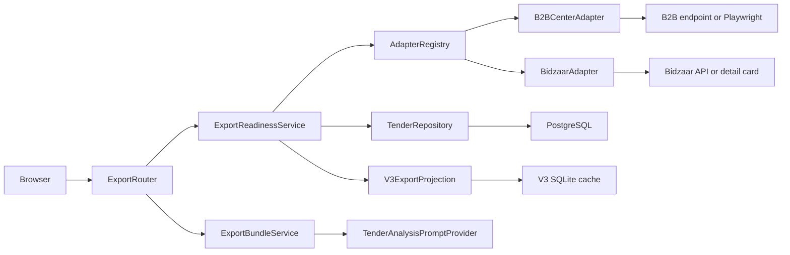

# Component Dependencies — TenderAutomation

## Матрица зависимостей

| Компонент | Зависит от |
|---|---|
| **B2BCenterAdapter** | PlatformAdapter (ABC), PlatformDescriptor, TenderModel |
| **BidzaarAdapter** | PlatformAdapter (ABC), PlatformDescriptor, TenderModel |
| **AdapterRegistry** | PlatformDescriptor, PlatformAdapter (ABC) |
| **CollectionService** | AdapterRegistry, TenderRepository |
| **QualificationService** | QualificationEngine, TenderRepository, QualifiedLogRepository |
| **PipelineOrchestrator** | CollectionService, QualificationService, EventBus, NotificationHandler |
| **NotificationHandler** | EventBus, TelegramNotifier |
| **TelegramNotifier** | — (только конфиг из .env) |
| **EmailDigest** | TenderRepository |
| **TenderRouter** | TenderRepository, SessionAuth |
| **ActionRouter** | TenderRepository, ActionLogRepository, SessionAuth |
| **ExportService** | TenderRepository, QualifiedLogRepository |
| **SessionAuth** | TenderRepository (user lookup) |

## Диаграмма зависимостей по unit'ам

```
┌──────────────────────────────────────────────┐
│  Unit 1: Core Library                        │
│                                              │
│  TenderModel ◄─── все компоненты             │
│  PlatformAdapter (ABC) ◄─── Adapters Unit    │
│  PlatformDescriptor ◄─── Adapters Unit       │
│  QualificationEngine                         │
│  TenderRepository ◄─── Web, Notifications    │
│  QualifiedLogRepository ◄─── Web, Pipeline  │
│  ActionLogRepository ◄─── Web               │
│  EventBus ◄─── Pipeline, Notifications      │
│  CollectionService                           │
│  QualificationService                        │
│  PipelineOrchestrator                        │
└──────────────────────────────────────────────┘
           ▲                    ▲
           │                    │
┌──────────┴──────────┐  ┌──────┴───────────────┐
│  Unit 2: Adapters   │  │  Unit 4: Notifications│
│                     │  │                       │
│  B2BCenterAdapter   │  │  NotificationHandler  │
│  BidzaarAdapter     │  │  TelegramNotifier     │
│  AdapterRegistry    │  │  EmailDigest          │
└─────────────────────┘  └───────────────────────┘
                                    ▲
                                    │ (EventBus events)
┌──────────────────────────────────┐│
│  Unit 3: Web Application         ││
│                                  ││
│  FastAPIApp                      │
│  SessionAuth                     │
│  TenderRouter                    │
│  ActionRouter                    │
│  HistoryRouter                   │
│  ExportService                   │
└──────────────────────────────────┘
```

## Потоки данных

### Поток 1: Cron pipeline (сбор + квалификация + уведомление)
```
.env credentials
    └──► PlatformAdapter.authenticate()
              └──► PlatformAdapter.fetch_new() ──► RawTender[]
                        └──► adapter.map_to_tender() ──► Tender[]
                                  └──► TenderRepository.save_batch() ──► PostgreSQL
                                            └──► QualificationEngine.apply_tier1_batch()
                                                      └──► TenderRepository.update_qualification()
                                                      └──► QualifiedLogRepository.append_batch() ──► tenders.jsonl
                                                                └──► EventBus.publish('tenders_qualified')
                                                                          └──► TelegramNotifier.send_alert()
```

### Поток 2: Специалист просматривает тендеры (веб)
```
Browser (GET /tenders)
    └──► SessionAuth.get_current_user() ──► User (из PostgreSQL)
              └──► TenderRouter.list_tenders()
                        └──► TenderRepository.get_qualified() ──► PostgreSQL
                                  └──► Jinja2 Template ──► HTML Response
```

### Поток 3: Специалист скачивает данные для AI-анализа
```
Browser (GET /export)
    └──► SessionAuth ──► TenderRouter.export()
              └──► ExportService.build_export_bundle()
                        ├──► TenderRepository.get_qualified() ──► PostgreSQL
                        └──► AGENTS.md file read
                                  └──► ZIP(tenders.jsonl + AGENTS.md) ──► Download
```

### Поток 4: Специалист загружает результат AI-анализа
```
Browser (POST /tenders/{id}/analysis)
    └──► SessionAuth ──► ActionRouter.upload_analysis()
              └──► TenderRepository.save_analysis() ──► PostgreSQL
```

### Поток 5: Специалист фиксирует решение
```
Browser (POST /tenders/{id}/action)
    └──► SessionAuth ──► ActionRouter.record_action()
              ├──► TenderRepository.save_action() ──► PostgreSQL
              └──► ActionLogRepository.append() ──► actions.jsonl
```

## Правила связности

- **Core не зависит от Web, Adapters, Notifications** — зависимости только вниз
- **Adapters не зависят от Web и Notifications** — только от Core interfaces
- **Notifications не зависят от Web** — получают данные только через EventBus или прямой доступ к Core repositories
- **Web не зависит от Adapters напрямую** — коллекция запускается cron-скриптом, Web читает уже собранные данные из PostgreSQL
- **EventBus in-process** — работает только в рамках pipeline cron-процесса; Web-процесс не использует EventBus

---

## Export Integrity — зависимости текущей итерации

### Dependency matrix

| Компонент | Зависит от | Не должен зависеть от |
|---|---|---|
| `TenderInspectionResult` | Core models | Web, concrete adapters |
| `PlatformAdapter.inspect_tender` | Core models | Repository, FastAPI |
| Concrete adapters | PlatformAdapter, platform clients/parsers | Web, PostgreSQL |
| `TenderRepository.apply_inspection` | ORM, PostgreSQL | adapters, V3 cache |
| `V3ExportProjection` | existing V3 SQLite cache | Web templates, adapters |
| `ExportReadinessService` | AdapterRegistry, repository, V3 projection | FastAPI, ZIP/Jinja2 |
| `TenderAnalysisPromptProvider` | versioned prompt asset, semantic config | repository, adapters |
| `ExportBundleService` | readiness DTO, prompt artifact | network clients, credentials |
| `ExportRouter` | auth, readiness service, bundle service | concrete adapters |

### Dependency flow



Текстовая альтернатива: Web router зависит только от readiness и bundle services.
Readiness получает adapters через registry, сохраняет результат в PostgreSQL и
читает V3 через projection. Bundle service использует отдельный prompt provider.
Concrete adapters и credentials не попадают в Web layer.

### Правила связности

1. `procedure_state` хранится отдельно от `TenderStatus`; archive view использует
   procedure state и дедлайн, а решения специалиста не затираются.
2. Concrete adapters создаются только в composition root и доступны Core service
   через registry.
3. Adapter возвращает immutable result и не пишет в БД.
4. Repository не интерпретирует HTTP status или CAPTCHA; он принимает уже
   normalized result.
5. Export bundle не выполняет I/O к площадкам и потому детерминированно тестируется.
6. V3 judge/queue rules имеют одного владельца — `V3ExportProjection`; router и
   exporter не дублируют SQL и формулы.
7. Runtime prompt asset отделён от корневого developer `AGENTS.md`.
