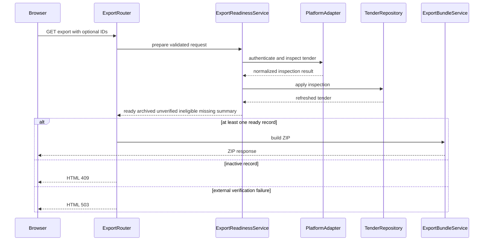

# Services — TenderAutomation

## Обзор сервисного слоя

Сервисы оркестрируют компоненты для реализации бизнес-сценариев. Компоненты (адаптеры, репозитории, движки) не знают друг о друге — сервисы связывают их.

---

## CollectionService

**Расположение**: `src/core/services/collection.py`
**Назначение**: Оркестрация сбора тендеров с одной или всех площадок.

```python
class CollectionService:
    def __init__(
        self,
        registry: AdapterRegistry,
        repository: TenderRepository,
    ): ...

    async def run_for_platform(
        self, platform_id: str
    ) -> CollectionResult:
        """
        1. Получает адаптер и дескриптор из AdapterRegistry
        2. Читает метку времени последнего успешного сбора из БД
        3. Вызывает adapter.authenticate() с credentials из .env
        4. Вызывает adapter.fetch_new(session, since, descriptor)
        5. Маппит RawTender → Tender через adapter.map_to_tender()
        6. Сохраняет пакет через TenderRepository.save_batch()
        7. Обновляет метку последнего сбора
        8. Возвращает CollectionResult(platform_id, new_count, errors)
        """

    async def run_all(self) -> list[CollectionResult]:
        """Запускает run_for_platform() для всех зарегистрированных адаптеров.
        Ошибка одной площадки не прерывает сбор с других."""
```

---

## QualificationService

**Расположение**: `src/core/services/qualification.py`
**Назначение**: Квалификация новых (ещё не оценённых) тендеров по двухуровневым фильтрам.

```python
class QualificationService:
    def __init__(
        self,
        engine: QualificationEngine,
        repository: TenderRepository,
        qualified_log: QualifiedLogRepository,
        rules_path: Path,
    ): ...

    def qualify_pending(self) -> QualificationResult:
        """
        1. Загружает правила из rules_path через engine.load_rules()
        2. Читает из БД тендеры со статусом 'pending' (ещё не квалифицированные)
        3. Вызывает engine.apply_tier1_batch()
        4. Обновляет score и tier в БД через TenderRepository.update_qualification()
        5. Тендеры с score > 0 дописывает в QualifiedLogRepository
        6. Возвращает QualificationResult(total, qualified_count, filtered_count)
        """
```

---

## PipelineOrchestrator

**Расположение**: `src/core/services/pipeline.py`
**Назначение**: Единая точка входа для cron job. Запускает полный цикл: сбор → квалификация → публикация событий.

```python
class PipelineOrchestrator:
    def __init__(
        self,
        collection: CollectionService,
        qualification: QualificationService,
        event_bus: EventBus,
        notification_handler: NotificationHandler,
    ): ...

    async def run(self) -> PipelineResult:
        """
        1. Вызывает CollectionService.run_all()
        2. Вызывает QualificationService.qualify_pending()
        3. Если qualified_count > 0:
             EventBus.publish('tenders_qualified',
                              count=qualified_count,
                              platform_summary=...)
        4. Логирует результат, возвращает PipelineResult
        """
```

**Точка входа cron** (`src/core/cli.py`):
```python
# Вызывается системным cron: python -m core.cli run-pipeline
# Один Python-процесс: сбор → квалификация → in-process события → уведомления
```

---

## ExportService

**Расположение**: `src/web/services/export.py`
**Назначение**: Формирование экспортного пакета (JSONL + AGENTS.md) для скачивания специалистом.

```python
class ExportService:
    def __init__(
        self,
        repository: TenderRepository,
        qualified_log: QualifiedLogRepository,
        agents_md_path: Path,
    ): ...

    def build_export_bundle(
        self, tender_ids: list[str] | None = None
    ) -> ExportBundle:
        """
        1. Если tender_ids указаны — загружает только их; иначе — все новые квалифицированные
        2. Сериализует каждый Tender в JSON-строку (одна строка = один тендер)
        3. Читает AGENTS.md, подставляет актуальные семантические правила Tier 2
        4. Возвращает ExportBundle(jsonl_content, agents_md_content, filename_prefix)
        """
```

---

## Схема взаимодействия сервисов

```
PIPELINE PROCESS (запускается cron):
┌─────────────────────────────────────────────────────────┐
│  PipelineOrchestrator.run()                             │
│    │                                                    │
│    ├── CollectionService.run_all()                      │
│    │     ├── B2BCenterAdapter.fetch_new()               │
│    │     ├── BidzaarAdapter.fetch_new()                 │
│    │     └── TenderRepository.save_batch()  ──► PostgreSQL│
│    │                                                    │
│    ├── QualificationService.qualify_pending()           │
│    │     ├── QualificationEngine.apply_tier1_batch()    │
│    │     ├── TenderRepository.update_qualification() ──► PostgreSQL│
│    │     └── QualifiedLogRepository.append_batch() ──► tenders.jsonl│
│    │                                                    │
│    └── EventBus.publish('tenders_qualified')            │
│          └── NotificationHandler.on_tenders_qualified() │
│                └── TelegramNotifier.send_alert()        │
└─────────────────────────────────────────────────────────┘

WEB PROCESS (FastAPI, gunicorn):
┌─────────────────────────────────────────────────────────┐
│  Browser ──► SessionAuth ──► TenderRouter               │
│                               └── TenderRepository ──► PostgreSQL│
│             SessionAuth ──► ActionRouter                │
│                               ├── TenderRepository.save_action() ──► PostgreSQL│
│                               └── ActionLogRepository.append() ──► actions.jsonl│
│             SessionAuth ──► ExportService               │
│                               └── JSONL + AGENTS.md ──► Download│
└─────────────────────────────────────────────────────────┘

EMAIL DIGEST CRON (отдельный cron job, раз в сутки):
┌─────────────────────────────────────────────────────────┐
│  python -m notifications.cli send-digest                │
│    └── EmailDigest.send() ──► SMTP ──► recipients       │
└─────────────────────────────────────────────────────────┘
```

---

## Export Integrity — orchestration текущей итерации

### `ExportReadinessService`

**Расположение**: `src/core/services/export_readiness.py`.

**Граница**: Core service. Он зависит от абстрактного `PlatformAdapter` через
`AdapterRegistry`, repository и read-only V3 projection, но не от FastAPI,
Jinja2 или ZIP.

**Высокоуровневый flow**:

1. Получить кандидатов через `TenderRepository.get_export_candidates`.
2. Для каждой площадки получить зарегистрированный adapter и одну session.
3. Для неполной либо не подтверждённой свежей карточки вызвать
   `adapter.inspect_tender` в пределах bounded orchestration.
4. Сохранить только валидные поля и normalized procedure state через repository.
5. Вычислить archive eligibility независимо от пользовательского workflow status.
6. Получить финальный V3 context через `V3ExportProjection`.
7. Вернуть `ready`, `archived`, `unverified`, `ineligible`, `missing` и summary.

Сервис не вызывает LLM. External failure не преобразуется в archive state.

### `TenderAnalysisPromptProvider`

**Расположение**: `src/web/services/export_prompt.py` либо эквивалентный модуль
application layer.

**Flow**:

1. Открыть детерминированный versioned asset
   `prompts/tender_analysis_agents.md`.
2. Проверить, что файл непустой и содержит обязательные contract sections.
3. Подставить semantic profile и отклонить оставшиеся обязательные placeholders.
4. Вычислить SHA-256 фактического UTF-8 payload.
5. Вернуть `PromptArtifact` без fallback на пустую строку.

### `ExportBundleService`

**Расположение**: `src/web/services/export.py`.

**Flow**:

1. Принять только `ExportPreparationResult`; service сам не читает площадки.
2. Если `ready` пуст, не создавать ZIP.
3. Сериализовать расширенный JSONL с legacy, V3, procedure и completeness
   context.
4. Создать `export_manifest.json` с schema version, prompt version/hash,
   document inclusion flag и агрегатами outcomes.
5. Записать три обязательных member: JSONL, `AGENTS.md`, manifest.
6. Перед возвратом проверить member names, непустой prompt и совпадение hash.

### `ExportRouter`

**Расположение**: `src/web/routers/export_router.py`.

**Flow**:

1. Проверить session authentication.
2. Разобрать ID по allowlist format и batch limit.
3. Await `ExportReadinessService.prepare`.
4. Для одиночного inactive результата вернуть HTML 409; для unverified external
   failure — HTML 503.
5. Для bulk flow сформировать ZIP только из `ready` и отразить counts в manifest.
6. Если ready пуст, вернуть безопасную result page вместо пустого JSONL.

### Composition root

`core.bootstrap` создаёт registry с B2B-Center и Bidzaar adapters, repository,
V3 projection и readiness service. Web получает готовые abstractions; он не
импортирует concrete adapter classes. Credentials читаются существующим
credential provider только внутри authentication flow.

## Result flow



Текстовая альтернатива: router передаёт валидированный запрос readiness service;
тот инспектирует площадку и сохраняет результат. Active records передаются pure
ZIP builder. Inactive records дают 409, а временно неподтверждённые — 503.
