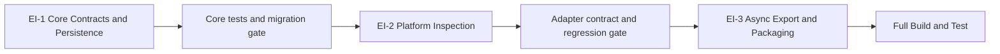

# Unit of Work Dependencies — TenderAutomation

## Матрица зависимостей

| | Unit 1: Core | Unit 2: Adapters | Unit 3: Web App | Unit 4: Notifications |
|---|:---:|:---:|:---:|:---:|
| **Unit 1: Core** | — | provides | provides | provides |
| **Unit 2: Adapters** | depends | — | independent | independent |
| **Unit 3: Web App** | depends | independent | — | independent |
| **Unit 4: Notifications** | depends | independent | independent | — |

**Вывод**: Unit 1 — единственная зависимость для всех остальных. Units 2, 3, 4 не зависят друг от друга.

## Детализация зависимостей

### Unit 2 → Unit 1
| Что импортирует | Из какого модуля |
|---|---|
| `PlatformAdapter` (ABC) | `core.adapters.base` |
| `TenderModel`, `RawTender` | `core.models.tender` |
| `PlatformDescriptor`, `PlatformCredentials`, `AuthSession` | `core.models.platform` |

### Unit 3 → Unit 1
| Что импортирует | Из какого модуля |
|---|---|
| `TenderRepository` | `core.repositories.tender` |
| `ActionLogRepository` | `core.repositories.action_log` |
| `QualifiedLogRepository` | `core.repositories.qualified_log` |
| `TenderModel`, `TenderAction`, `AnalysisResult` | `core.models.*` |

### Unit 4 → Unit 1
| Что импортирует | Из какого модуля |
|---|---|
| `EventBus` | `core.events.bus` |
| `TenderRepository` | `core.repositories.tender` |
| `TenderModel` | `core.models.tender` |

## Диаграмма зависимостей

```
Unit 1: Core Library
    src/core/
         │
         ├──────────────────────┐
         │                      │
         ▼                      ▼
Unit 2: Platform Adapters   Unit 3: Web Application
    src/adapters/               src/web/
    (B2BCenter, Bidzaar)        (FastAPI, Jinja2, Auth)
         │                      │
         │ (нет прямой          │ (нет прямой
         │  зависимости)        │  зависимости)
         │                      │
         └──────────────────────┘
                   │
                   │ (нет прямой зависимости)
                   │
         ▼
Unit 4: Notification Service
    src/notifications/
    (Telegram, Email)
```

## Общие данные через PostgreSQL

Units 2, 3, 4 не зависят напрямую друг от друга в коде, но взаимодействуют через общее состояние:

| Данные | Записывает | Читает |
|---|---|---|
| Тендеры (PostgreSQL) | Unit 2 (через Core) | Unit 3 (через Core) |
| Квалификация (PostgreSQL + JSONL) | Unit 1 QualificationService | Unit 3, Unit 4 |
| Действия специалистов (PostgreSQL + JSONL) | Unit 3 | Unit 4 (email digest) |
| EventBus события | Unit 1 PipelineOrchestrator | Unit 4 NotificationHandler |

## Последовательность разработки

```
Sprint/Iteration 1:
  ┌─────────────────────────────────────────┐
  │  Unit 1: Core Library                   │
  │  Критический путь: все интерфейсы       │
  │  Длительность: ~2–3 недели              │
  └─────────────────────────────────────────┘
                      │
                      ▼
Sprint/Iteration 2:
  ┌─────────────────────────────────────────┐
  │  Unit 2: Platform Adapters              │
  │  Зависит от: Core interfaces            │
  │  Длительность: ~1–2 недели              │
  └─────────────────────────────────────────┘
                      │
                      ▼
Sprint/Iteration 3:
  ┌─────────────────────────────────────────┐
  │  Unit 3: Web Application                │
  │  Зависит от: Core repositories/models  │
  │  Длительность: ~2–3 недели              │
  └─────────────────────────────────────────┘
                      │
                      ▼
Sprint/Iteration 4:
  ┌─────────────────────────────────────────┐
  │  Unit 4: Notification Service           │
  │  Зависит от: Core EventBus              │
  │  Длительность: ~1 неделя               │
  └─────────────────────────────────────────┘
```

## API-контракты между unit'ами

### PlatformAdapter interface (Unit 1 → Unit 2)
```python
# Unit 2 ДОЛЖЕН реализовать весь ABC:
class PlatformAdapter(ABC):
    def platform_id(self) -> str: ...
    async def authenticate(self, credentials) -> AuthSession: ...
    async def fetch_new(self, session, since, descriptor) -> list[RawTender]: ...
    def map_to_tender(self, raw, descriptor) -> Tender: ...
```

### EventBus contract (Unit 1 → Unit 4)
```python
# Unit 4 подписывается на:
event_bus.subscribe('tenders_qualified', handler)
# Payload: count: int, platform_summary: dict[str, int]
```

### Repository interface (Unit 1 → Unit 3)
```python
# Unit 3 использует только публичные методы TenderRepository
# Прямой доступ к БД из Unit 3 запрещён — только через репозитории Core
```

---

# Export Integrity — зависимости текущей итерации

## Dependency matrix

| Unit | Зависит от | Предоставляет следующему unit |
|---|---|---|
| EI-1 Core Contracts & Persistence | existing Core/ORM/Alembic/V3 cache | inspection DTO/ABC, repository API, readiness DTO/service, V3 projection |
| EI-2 Platform Inspection | EI-1 inspection contract | две concrete inspection реализации и normalized outcomes |
| EI-3 Async Export & Packaging | EI-1 readiness/persistence/V3; EI-2 adapters | authenticated browser flow, prompt/manifest/ZIP, Docker/smoke |

## Critical path



Текстовая альтернатива: EI-1 завершается migration/Core gate, затем EI-2 —
adapter contract/regression gate, после чего EI-3 подключает export flow и
запускает полный Build & Test.

## Integration contracts

| Producer | Contract | Consumer |
|---|---|---|
| EI-1 | `TenderInspectionResult` | EI-2 concrete adapters |
| EI-1 | `PlatformAdapter.inspect_tender` | EI-2 implementations, readiness service |
| EI-2 | normalized procedure/enrichment outcome | EI-1 readiness service |
| EI-1 | `ExportPreparationResult` | EI-3 router/bundle service |
| EI-1 | `V3ExportContext` | EI-3 JSONL/list/detail |
| EI-3 | `PromptArtifact` + manifest schema | ZIP consumers and tests |

## Testing checkpoints

1. **После EI-1**: migration upgrade, repository integration, mypy Core scope,
   example/PBT state tests.
2. **После EI-2**: mocked endpoint/Playwright/API/detail responses, error taxonomy,
   no-network unit suite.
3. **После EI-3**: authenticated web integration, ZIP properties, Docker image,
   smoke, complete security/static/dependency suite and coverage gate.

## Coordination and rollback

- Один владелец выполняет units последовательно; параллельных conflicting edits нет.
- Migration создаётся в EI-1 и изменяется только до завершения EI-1 gate.
- Migration аддитивна; rollback application image не требует немедленного schema
  downgrade.
- External inspection выключается откатом image; сохранённые procedure fields не
  ломают старый reader.
- EI-3 не может обходить EI-1 readiness result или вызывать concrete adapters.

## Cycle check

Зависимости образуют DAG `EI-1 → EI-2 → EI-3`. EI-2 возвращает данные через
интерфейс EI-1, но не импортируется Core-модулями напрямую: concrete registration
выполняется composition root, поэтому compile-time cycle отсутствует.
