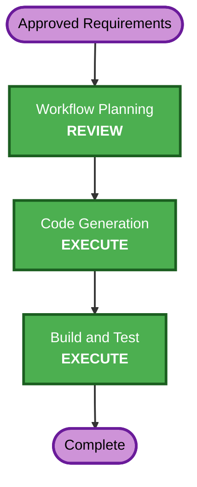

# Execution Plan - Commit ID on Admin Navigation Bar

## Detailed Analysis Summary

### Transformation Scope

- **Transformation type**: Single existing web component plus build metadata wiring.
- **Primary change**: Expose the source commit SHA from GitLab image build to the
  application and render its short form in the `/admin` navigation bar.
- **Related components**: GitLab CI, Dockerfile, runtime Settings, admin router, base
  template, unit tests, and production smoke test.

### Change Impact Assessment

- **User-facing changes**: Yes; administrators see the deployed commit ID.
- **Structural changes**: No; existing environment configuration and template context
  patterns are reused.
- **Data model changes**: No.
- **API changes**: No.
- **NFR impact**: Positive deployment traceability; no performance or security impact.

### Component Relationships

- **GitLab build job** passes `CI_COMMIT_SHA` as a Docker build argument.
- **Dockerfile** persists the value as `APP_COMMIT_SHA` in the image environment.
- **Settings** reads `APP_COMMIT_SHA` with a safe `unknown` default.
- **Admin router** validates and shortens the value, then adds it to the template context.
- **Base template** renders the label only when the admin context variable is defined.
- **Tests** verify transformation, HTML rendering, CI/Docker wiring, and runtime smoke.

### Risk Assessment

- **Risk level**: Low.
- **Rollback complexity**: Easy; revert the single change commit or redeploy the previous
  image.
- **Testing complexity**: Simple; no external live calls or database migration required.

## Workflow Visualization

Text alternative: approved requirements proceed to workflow approval, then code generation,
then build and test, then completion.

## Phases to Execute

### INCEPTION PHASE

- [x] Workspace Detection - completed.
- [x] Reverse Engineering context - existing artifacts plus current Graphify analysis.
- [x] Requirements Analysis - approved.
- [x] User Stories - SKIP; one clear administrator-facing acceptance path.
- [x] Workflow Planning - approved.
- [x] Application Design - SKIP; no new component or service.
- [x] Units Generation - SKIP; single change unit.

### CONSTRUCTION PHASE

- [x] Functional Design - SKIP; bounded metadata display with existing patterns.
- [x] NFR Requirements - SKIP; existing security/test requirements are sufficient.
- [x] NFR Design - SKIP; no new NFR mechanism.
- [x] Infrastructure Design - SKIP; existing GitLab-to-Docker build path is reused.
- [x] Code Generation - completed; focused tests passed.
- [ ] Build and Test - EXECUTE.

### OPERATIONS PHASE

- [ ] Operations - PLACEHOLDER; deployment execution is outside this change workflow.

## Code Generation Sequence

1. Add `APP_COMMIT_SHA` runtime setting with `unknown` fallback.
2. Add a deterministic short-SHA formatter and pass the result only from `/admin`.
3. Render the label in the shared top bar only when the admin context defines it; add a
   stable `data-testid`.
4. Embed `CI_COMMIT_SHA` in the production image through a Docker build argument.
5. Add focused unit and deployment contract tests.
6. Extend the production smoke test to verify the authenticated `/admin` page contains
   the commit label.
7. Update AI-DLC progress and implementation summary.

## Testing Checkpoints

1. Focused unit tests for SHA formatting, template rendering, and CI/Docker contract.
2. Full pytest/Hypothesis suite with fixed seed.
3. Strict mypy, Bandit, pip-audit, pip check, and diff validation.
4. Production Docker image build with a known SHA.
5. Isolated Docker smoke test confirming the known short SHA on `/admin`.

## Success Criteria

- `/admin` shows the expected eight-character SHA in the top bar.
- Local runs without metadata show `unknown`.
- Other pages remain unchanged.
- The deployed value is traceable to `CI_COMMIT_SHA` without requiring `.git` in the image.
- All quality and security gates pass.

## Security Compliance

- **Compliant**: SECURITY-03, SECURITY-08, SECURITY-09, SECURITY-12, SECURITY-13.
- **N/A**: Remaining SECURITY rules; no affected storage, network, authentication,
  dependency, or external-call boundary.
- **Blocking findings**: None.

## PBT Compliance

PBT-01 through PBT-10 are N/A for this static configuration and template change. Focused
example-based tests are the appropriate verification method; the existing Hypothesis suite
will still run as part of the full regression gate.

## Estimated Scope

- **Stages to execute**: Code Generation and Build and Test.
- **Files expected to change**: Approximately seven application, deployment, test, and
  AI-DLC files.
- **Estimated implementation time**: Less than one focused development cycle.
