# Execution Plan - Deadline Extraction, Archive, and 60% Coverage

## Detailed Analysis Summary

### Transformation Scope

- **Transformation type**: Coordinated brownfield enhancement across existing Core, Adapters, Web, CLI, and CI boundaries.
- **Primary changes**: Strict deadline parsing, conditional detail-page enrichment, computed Archive behavior, Bidzaar URL normalization, bounded reconciliation, and a project-wide 60% line-coverage gate.
- **Related components**: `src/core/`, `src/adapters/b2bcenter/`, `src/adapters/bidzaar/`, `src/web/`, core CLI, tests, `pyproject.toml`, `.gitlab-ci.yml`, README, and AI-DLC build evidence.

### Change Impact Assessment

- **User-facing changes**: Yes. P1/P2 exclude expired tenders; Archive becomes a visible tab; `/admin` gains a bounded reconciliation action.
- **Structural changes**: Minor. Existing services, repositories, adapters, routers, and CLI entry points are extended without changing the monolith boundaries.
- **Data model changes**: No schema migration. Archive is computed; deadline provenance remains in `raw_data`.
- **API changes**: One authenticated admin mutation is added; CLI receives the equivalent reconciliation command.
- **NFR impact**: Significant test expansion, strict external-call failure isolation, bounded reconciliation input, allowlisted URLs, and blocking coverage enforcement.

### Component Relationships

- **Core repository/services**: Own reusable expiry classification, reconciliation selection/update behavior, counters, and idempotency contracts.
- **B2B-Center adapter**: Supplies strict listing/detail parsers and endpoint/Playwright fallback implementations while retaining both transports.
- **Bidzaar adapter**: Supplies strict API/detail parsing and canonical URL construction from `external_id`.
- **Web application**: Consumes computed expiry state for P1/P2/Archive and invokes reconciliation through the authenticated admin route.
- **CLI**: Invokes the same reconciliation business operation as the admin route.
- **CI and tests**: Verify all boundaries and enforce at least 60% aggregate `src/` line coverage.

### Risk Assessment

- **Risk level**: Moderate-high. A false expiry decision can hide an active tender; uncontrolled fallback calls can overload a platform; reconciliation updates production records.
- **Rollback complexity**: Moderate. Application changes are revertible; reconciled canonical URLs and confirmed deadlines are safe, monotonic data corrections.
- **Testing complexity**: High. Deterministic unit, property, router/integration, failure-isolation, CLI, and smoke coverage is required without relying on live platforms.

## Workflow Visualization

```mermaid
flowchart TD
    Start(["Approved User Stories"])
    WD["Workspace Detection<br/><b>COMPLETED</b>"]
    RE["Reverse Engineering<br/><b>COMPLETED</b>"]
    RA["Requirements Analysis<br/><b>COMPLETED</b>"]
    US["User Stories<br/><b>COMPLETED</b>"]
    WP["Workflow Planning<br/><b>REVIEW</b>"]
    AD["Application Design<br/><b>SKIP</b>"]
    UG["Units Generation<br/><b>SKIP</b>"]
    FD["Functional Design<br/><b>EXECUTE</b>"]
    NFRA["NFR Requirements<br/><b>SKIP</b>"]
    NFRD["NFR Design<br/><b>SKIP</b>"]
    ID["Infrastructure Design<br/><b>SKIP</b>"]
    CG["Code Generation<br/><b>EXECUTE</b>"]
    BT["Build and Test<br/><b>EXECUTE</b>"]
    End(["Merge Ready"])

    Start --> WD --> RE --> RA --> US --> WP --> AD --> UG --> FD --> NFRA --> NFRD --> ID --> CG --> BT --> End

    style WD fill:#4CAF50,stroke:#1B5E20,stroke-width:3px,color:#fff
    style RE fill:#4CAF50,stroke:#1B5E20,stroke-width:3px,color:#fff
    style RA fill:#4CAF50,stroke:#1B5E20,stroke-width:3px,color:#fff
    style US fill:#4CAF50,stroke:#1B5E20,stroke-width:3px,color:#fff
    style WP fill:#4CAF50,stroke:#1B5E20,stroke-width:3px,color:#fff
    style FD fill:#FFA726,stroke:#E65100,stroke-width:3px,stroke-dasharray:5 5,color:#000
    style CG fill:#4CAF50,stroke:#1B5E20,stroke-width:3px,color:#fff
    style BT fill:#4CAF50,stroke:#1B5E20,stroke-width:3px,color:#fff
    style AD fill:#BDBDBD,stroke:#424242,stroke-width:2px,stroke-dasharray:5 5,color:#000
    style UG fill:#BDBDBD,stroke:#424242,stroke-width:2px,stroke-dasharray:5 5,color:#000
    style NFRA fill:#BDBDBD,stroke:#424242,stroke-width:2px,stroke-dasharray:5 5,color:#000
    style NFRD fill:#BDBDBD,stroke:#424242,stroke-width:2px,stroke-dasharray:5 5,color:#000
    style ID fill:#BDBDBD,stroke:#424242,stroke-width:2px,stroke-dasharray:5 5,color:#000
    style Start fill:#CE93D8,stroke:#6A1B9A,stroke-width:3px,color:#000
    style End fill:#CE93D8,stroke:#6A1B9A,stroke-width:3px,color:#000
    linkStyle default stroke:#333,stroke-width:2px
```

Text alternative: completed inception context proceeds through Workflow Planning review; existing Application Design and Units are reused; Functional Design executes; standalone NFR and Infrastructure stages are skipped; Code Generation and Build and Test execute before merge readiness.

## Phases to Execute

### INCEPTION PHASE

- [x] Workspace Detection - completed for the existing brownfield repository.
- [x] Reverse Engineering - existing artifacts plus current Graphify impact analysis.
- [x] Requirements Analysis - approved, including the permanent 60% coverage NFR.
- [x] User Stories - approved, including US-04, US-08, and US-09 changes.
- [x] Workflow Planning - plan created; approval pending.
- [x] Application Design - SKIP. Existing Core/Adapter/Web/CLI boundaries remain authoritative; no new deployable component is introduced.
- [x] Units Generation - SKIP. Existing Core, Adapters, and Web units already describe the affected ownership and dependencies.

### CONSTRUCTION PHASE

- [x] Functional Design - EXECUTED AND APPROVED. Defined source precedence, strict parsing, page-fallback isolation, expiry classification, reconciliation idempotency, input bounds, and testable properties.
- [x] NFR Requirements - SKIP as a standalone stage. Security, reliability, performance, and 60% coverage requirements are complete in the approved change requirements.
- [x] NFR Design - SKIP as a standalone stage. Existing structured logging, auth, rate limiting, CI, and Hypothesis mechanisms are reused and verified in Functional Design/Code Generation.
- [x] Infrastructure Design - SKIP. No new service, database, queue, network boundary, or deployment topology is introduced.
- [x] Code Generation - EXECUTED AND APPROVED. Produced and completed the change-specific implementation plan, code, tests, and evidence.
- [x] Build and Test - EXECUTED. Focused/full suites, coverage, static/security/dependency checks, Docker build, SBOM, and smoke verification passed; review approval pending.

### OPERATIONS PHASE

- [ ] Operations - PLACEHOLDER. Production execution and deployment remain a separate explicit action after merge readiness.

## Module Update Strategy

- **Update approach**: Sequential critical path with tests added alongside each layer.
- **Critical path**: Core contracts and pure deadline/archive helpers before adapters and web/CLI consumers.
- **Coordination points**: `TenderModel.deadline`, `raw_data` provenance, repository update boundaries, canonical Bidzaar URL, admin authorization, and common reconciliation result counters.
- **Rollback strategy**: Revert application commit and redeploy previous image. No destructive deletion or workflow-status rewrite is permitted.

### Package Change Sequence

1. **Core and test utilities**
   - Add pure timezone-aware expiry classification and reconciliation contracts.
   - Add repository operations for bounded candidate selection and safe field updates.
   - Add deterministic unit/property tests first.
2. **Platform adapters**
   - Strengthen B2B-Center listing/detail parsing and reuse endpoint/Playwright sessions.
   - Normalize Bidzaar URLs and add missing-deadline detail fallback.
   - Verify partial-source failure and request bounds with mocked external responses.
3. **Web and CLI**
   - Add Archive count/filter/order behavior.
   - Add validated admin reconciliation mutation and equivalent CLI command.
   - Add stable test selectors and route/authorization tests.
4. **Coverage and CI gate**
   - Add meaningful tests to under-tested Core, Adapter, Web, and CLI paths until aggregate coverage is at least 60%.
   - Configure `--cov-fail-under=60` in local project settings and GitLab CI while preserving terminal and XML reports.
5. **Integrated verification and documentation**
   - Run all deterministic gates, build the production image, execute smoke tests, and update README/build evidence.

## Testing Checkpoints

1. Pure unit/PBT tests for dates, timezone boundaries, URL normalization, expiry, and idempotency.
2. Adapter tests with mocked listing, detail, 404, timeout, CAPTCHA/auth, and partial-mode failures.
3. Repository/service tests for bounded batches, partial updates, counters, and reruns.
4. Web/CLI tests for Archive, P1/P2, All, admin authorization, input validation, and equivalent outcomes.
5. Full suite with fixed Hypothesis seed and aggregate line coverage at or above 60%.
6. Strict mypy, Bandit, pip-audit, pip check, diff validation, Compose validation, production Docker build, and authenticated smoke test.

## Success Criteria

- Expired tenders are absent from P1/P2 and visible in Archive, newest expiry first.
- Workflow statuses remain unchanged and unknown deadlines are never guessed or archived.
- Both B2B-Center transports remain operational and independently failure-tolerant.
- Missing deadlines use a safe, conditional detail-page fallback for both platforms.
- Bidzaar URLs are canonical for new and reconciled records.
- Admin and CLI reconciliation are bounded, idempotent, equivalent, and secret-safe.
- Aggregate `src/` line coverage is at least 60%, and CI fails below the threshold.
- All security, PBT, type, dependency, container, and smoke gates pass.

## Extension Compliance

### Security Baseline

- Applicable: SECURITY-03, SECURITY-05, SECURITY-08, SECURITY-09, SECURITY-12, SECURITY-15.
- N/A: Infrastructure, encryption, IAM, and network-topology rules because those resources do not change.
- Blocking findings: None at planning; authorization, allowlisted URLs, bounded input, and safe logging are required downstream gates.

### Property-Based Testing

- Applicable: PBT-01, PBT-03, PBT-04, PBT-07 through PBT-10.
- N/A: PBT-02, PBT-05, PBT-06 for this scope unless Functional Design identifies an inverse, oracle, or state-machine property.
- Blocking findings: None at planning; identified invariants must appear in Functional Design and generated tests.

## Estimated Scope

- **Stages remaining before merge readiness**: Functional Design, Code Generation, Build and Test.
- **Implementation size**: Multi-component enhancement with no migration and a substantial test-coverage expansion.
- **Primary uncertainty**: Exact platform detail-page markup; deterministic fixtures and fail-safe extraction are required before any live verification.
