# Execution Plan — TenderAutomation

## Детальный анализ

### Тип трансформации (Brownfield)

**Архитектурная трансформация**: полное переплатформирование
- **От**: два независимых CLI-конвейера (Python-скрипты, SQLite per-scraper, ручной TXT-экспорт)
- **К**: единое серверное веб-приложение (Linux VPS, REST API + веб-UI, multi-user, планировщик, уведомления)

### Оценка изменений

| Область | Затронута | Описание |
|---|:---:|---|
| User-facing changes | ДА | Полностью новый браузерный интерфейс вместо CLI и TXT-файлов |
| Structural changes | ДА | Новая архитектура: platform abstraction layer, shared core, web server |
| Data model changes | ДА | Унифицированная схема тендеров, JSONL-логи, модель пользователей, сессии |
| API changes | ДА | Новый REST API для веб-UI; новый интерфейс platform adapter |
| NFR impact | ДА | Security Baseline (блокирующий) + PBT (блокирующий) включены |

### Оценка рисков

**Уровень риска**: HIGH
- Полное переплатформирование без промежуточного состояния
- Новые компоненты: веб-сервер, аутентификация, Telegram-бот, email-отправщик
- Security Baseline применяется как блокирующее ограничение
- Текущий рабочий код должен быть сохранён/перенесён без регрессий

**Сложность отката**: Moderate — текущие CLI-скрипты сохраняются до завершения Migration

---

## Единицы работы (Units) — 4 единицы

Система декомпозирована на 4 независимо разрабатываемых unit'а с последовательной зависимостью:

| Порядок | Unit | Зависит от | Описание |
|---|---|---|---|
| 1 | **Core Library** | — | Shared-ядро: platform interface, data models, qualification engine, storage |
| 2 | **Platform Adapters** | Core | Адаптеры B2B-Center и Bidzaar, рефакторинг существующего кода |
| 3 | **Web Application** | Core | FastAPI backend + минимальный веб-UI, аутентификация, экспорт JSONL |
| 4 | **Notification Service** | Core | Telegram-уведомления, email-дайджест |

### Компонентные зависимости

```
Core Library
    ├── Platform Adapters (использует: PlatformInterface, TenderModel, Storage)
    ├── Web Application  (использует: TenderModel, QualificationEngine, Storage, ActionLog)
    └── Notification Service (использует: TenderModel, Storage events)
```

---

## Workflow Visualization

```mermaid
flowchart TD
    Start(["Запрос пользователя"])

    subgraph INCEPTION["INCEPTION PHASE"]
        WD["Workspace Detection<br/>COMPLETED"]
        RE["Reverse Engineering<br/>COMPLETED"]
        RA["Requirements Analysis<br/>COMPLETED"]
        US["User Stories<br/>COMPLETED"]
        WP["Workflow Planning<br/>IN PROGRESS"]
        AD["Application Design<br/>EXECUTE"]
        UG["Units Generation<br/>EXECUTE"]
    end

    subgraph CONSTRUCTION["CONSTRUCTION PHASE"]
        subgraph PUL["Per-Unit Loop: 4 units"]
            FD["Functional Design<br/>EXECUTE per unit"]
            NFRA["NFR Requirements<br/>EXECUTE per unit"]
            NFRD["NFR Design<br/>EXECUTE per unit"]
            CG["Code Generation<br/>EXECUTE per unit"]
        end
        ID["Infrastructure Design<br/>EXECUTE — единый после всех unit'ов"]
        BT["Build and Test<br/>EXECUTE"]
    end

    subgraph OPERATIONS["OPERATIONS PHASE"]
        OPS["Operations<br/>PLACEHOLDER"]
    end

    Start --> WD --> RE --> RA --> US --> WP --> AD --> UG
    UG --> FD --> NFRA --> NFRD --> CG
    CG -->|"next unit"| FD
    CG --> ID
    ID --> BT
    BT -.-> OPS
    BT --> End(["Complete"])

    style WD fill:#4CAF50,stroke:#1B5E20,stroke-width:3px,color:#fff
    style RE fill:#4CAF50,stroke:#1B5E20,stroke-width:3px,color:#fff
    style RA fill:#4CAF50,stroke:#1B5E20,stroke-width:3px,color:#fff
    style US fill:#4CAF50,stroke:#1B5E20,stroke-width:3px,color:#fff
    style WP fill:#4CAF50,stroke:#1B5E20,stroke-width:3px,color:#fff
    style AD fill:#FFA726,stroke:#E65100,stroke-width:3px,stroke-dasharray:5 5,color:#000
    style UG fill:#FFA726,stroke:#E65100,stroke-width:3px,stroke-dasharray:5 5,color:#000
    style FD fill:#FFA726,stroke:#E65100,stroke-width:3px,stroke-dasharray:5 5,color:#000
    style NFRA fill:#FFA726,stroke:#E65100,stroke-width:3px,stroke-dasharray:5 5,color:#000
    style NFRD fill:#FFA726,stroke:#E65100,stroke-width:3px,stroke-dasharray:5 5,color:#000
    style ID fill:#FFA726,stroke:#E65100,stroke-width:3px,stroke-dasharray:5 5,color:#000
    style CG fill:#4CAF50,stroke:#1B5E20,stroke-width:3px,color:#fff
    style BT fill:#4CAF50,stroke:#1B5E20,stroke-width:3px,color:#fff
    style OPS fill:#BDBDBD,stroke:#424242,stroke-width:2px,stroke-dasharray:5 5,color:#000
    style Start fill:#CE93D8,stroke:#6A1B9A,stroke-width:3px,color:#000
    style End fill:#CE93D8,stroke:#6A1B9A,stroke-width:3px,color:#000
    style INCEPTION fill:#BBDEFB,stroke:#1565C0,stroke-width:2px,color:#000
    style CONSTRUCTION fill:#C8E6C9,stroke:#2E7D32,stroke-width:2px,color:#000
    style OPERATIONS fill:#FFF59D,stroke:#F57F17,stroke-width:2px,color:#000
    style PUL fill:#E8F5E9,stroke:#388E3C,stroke-width:1px,color:#000

    linkStyle default stroke:#333,stroke-width:2px
```



**Текстовая альтернатива:**
```
INCEPTION:  WD✓ → RE✓ → RA✓ → US✓ → WP(текущий) → AD → UG
CONSTRUCTION: [Unit 1 Core:        FD → NFR-Req → NFR-Des → CG]
              [Unit 2 Adapters:    FD → NFR-Req → NFR-Des → CG]
              [Unit 3 Web App:     FD → NFR-Req → NFR-Des → CG]
              [Unit 4 Notify:      FD → NFR-Req → NFR-Des → CG]
              → Infrastructure Design (единый для всей системы)
              → Build & Test
OPERATIONS: placeholder
```

---

## Фазы к выполнению

### INCEPTION PHASE

- [x] Workspace Detection — **COMPLETED**
- [x] Reverse Engineering — **COMPLETED**
- [x] Requirements Analysis — **COMPLETED**
- [x] User Stories — **COMPLETED**
- [x] Workflow Planning — **IN PROGRESS** (этот документ)
- [ ] Application Design — **EXECUTE**
  - *Обоснование*: Нужны новые компоненты (platform abstraction layer, web API, auth, scheduler), сервисный слой, определение интерфейсов между unit'ами
- [ ] Units Generation — **EXECUTE**
  - *Обоснование*: 4 отдельных unit'а с последовательными зависимостями — декомпозиция обязательна

### CONSTRUCTION PHASE (повторяется для каждого unit'а)

**Unit 1 — Core Library:**
- [ ] Functional Design — **EXECUTE** (новые data models, platform interface, qualification engine)
- [ ] NFR Requirements — **EXECUTE** (Security Baseline + PBT обязательны; выбор tech stack)
- [ ] NFR Design — **EXECUTE** (следует из NFR Requirements)
- [ ] Infrastructure Design — **SKIP** (единый для всех unit'ов, выполняется после Unit 4)
- [ ] Code Generation — **EXECUTE**

**Unit 2 — Platform Adapters:**
- [ ] Functional Design — **EXECUTE** (рефакторинг B2B-Center и Bidzaar под новый PlatformInterface)
- [ ] NFR Requirements — **EXECUTE** (Security: auth credentials, rate limiting)
- [ ] NFR Design — **EXECUTE**
- [ ] Infrastructure Design — **SKIP** (единый для всех unit'ов, выполняется после Unit 4)
- [ ] Code Generation — **EXECUTE**

**Unit 3 — Web Application:**
- [ ] Functional Design — **EXECUTE** (REST API endpoints, auth, JSONL export, AI analysis upload)
- [ ] NFR Requirements — **EXECUTE** (Security: HTTP headers, CORS, session, brute-force protection; PBT)
- [ ] NFR Design — **EXECUTE**
- [ ] Infrastructure Design — **SKIP** (единый для всех unit'ов, выполняется после Unit 4)
- [ ] Code Generation — **EXECUTE**

**Unit 4 — Notification Service:**
- [ ] Functional Design — **EXECUTE** (Telegram bot, email digest logic)
- [ ] NFR Requirements — **EXECUTE** (Security: token storage; rate limiting для Telegram)
- [ ] NFR Design — **EXECUTE**
- [ ] Infrastructure Design — **SKIP** (единый для всех unit'ов, выполняется ниже)
- [ ] Code Generation — **EXECUTE**

**Infrastructure Design (единый, после всех unit'ов) — EXECUTE:**
- [ ] Linux VPS: systemd-сервисы, gunicorn/uvicorn, reverse proxy (nginx)
- [ ] Cron-расписание для сбора тендеров
- [ ] Хранилище: SQLite + JSONL-файлы, файловая структура
- [ ] Деплой: директории, права, переменные окружения (.env)
- [ ] Мониторинг и логирование на уровне сервера

**Build and Test — EXECUTE** (always)

### OPERATIONS PHASE

- [ ] Operations — **PLACEHOLDER** (будущее расширение)

---

## Последовательность обновлений

```
Шаг 1: Unit 1 Core Library
        — блокирующий: все остальные unit'ы зависят от его интерфейсов
        — выход: пакет core/, data models, platform interface, JSONL storage

Шаг 2: Unit 2 Platform Adapters
        — параллельно: b2bcenter/ и bidzaar/ могут разрабатываться одновременно
        — зависит от: Core interfaces (PlatformInterface, TenderModel)

Шаг 3: Unit 3 Web Application
        — зависит от: Core storage, QualificationEngine, ActionLog
        — выход: web/, API endpoints, фронтенд

Шаг 4: Unit 4 Notification Service
        — зависит от: Core events, Storage
        — может разрабатываться параллельно с Unit 3
```

---

## Критерии успеха

**Основная цель**: рабочее серверное веб-приложение, автоматически собирающее и квалифицирующее тендеры, с веб-интерфейсом для нескольких специалистов

**Ключевые deliverables**:
- Унифицированный `core/` модуль с platform abstraction
- Адаптеры B2B-Center и Bidzaar под новым интерфейсом
- Веб-приложение: список тендеров, карточка, скачивание JSONL+AGENTS.md, загрузка AI-анализа, принятие решений
- JSONL-логи: обработанные тендеры + действия специалистов
- Telegram-уведомления + email-дайджест
- `AGENTS.md` — LLM-agnostic инструкция для AI-агентов

**Quality Gates**:
- Security Baseline: все правила SECURITY-01–SECURITY-15 compliant
- PBT: Hypothesis тесты для qualifier, JSONL serialization, data models
- Integration: полный цикл сбора → квалификация → UI → лог завершается за < 30 мин
