# План выполнения: целостный экспорт для AI

## Результат анализа

### Масштаб преобразования

- **Тип**: изменение нескольких компонентов в существующем монолите без смены
  инфраструктурной топологии.
- **Основной поток**: authenticated export route → export readiness orchestration
  → platform inspection → persistence → V3 projection → ZIP assembly.
- **Затронутые пакеты**: `src/core/`, `src/adapters/`, `src/web/`, Alembic,
  production Docker image и тесты.
- **Не затронуты**: Telegram, email, LLM-провайдеры и pipeline классификации V3.

### Оценка влияния

- **Пользовательский интерфейс**: да; скачивание может завершиться ZIP, переносом
  в Архив или безопасным сообщением о невозможности подтвердить актуальность.
- **Структура**: да; появится единый контракт инспекции карточки и orchestration
  готовности к экспорту.
- **Модель данных**: да; нужны состояние процедуры, результат и время последней
  проверки, provenance и безопасно сохраняемые детали.
- **API**: маршрут сохраняется, но обработка становится асинхронной и получает
  валидируемый набор ID.
- **NFR**: да; timeout, ограничение попыток/параллелизма, fail-closed и логирование.

### Риск

- **Уровень**: средне-высокий.
- **Причина**: внешний I/O запускается из пользовательского export flow и может
  обновлять архивное состояние в основной БД.
- **Откат**: старый image можно вернуть без удаления новых nullable-колонок;
  миграция должна быть аддитивной и обратно совместимой.
- **Тестирование**: unit + PBT + интеграция PostgreSQL/Alembic + mocked adapters +
  production-image smoke.

## Связи компонентов

| Компонент | Изменение | Зависимости |
|---|---|---|
| Domain models | результат инспекции, состояние процедуры, export metadata | нет |
| `PlatformAdapter` | единый async-контракт inspection/enrichment | Domain models |
| B2B-Center и Bidzaar adapters | реализация inspection через существующие endpoint/Playwright/HTTP механизмы | Adapter contract |
| `TenderRepository` | атомарное сохранение inspection и архивного результата | PostgreSQL, ORM |
| V3 projection | единое получение финальных verdict/score/confidence/queue | существующий V3 cache |
| Export readiness service | bounded orchestration, правила eligibility | adapters, repository, V3 projection |
| `ExportService` | prompt validation, JSONL, manifest, ZIP invariants | readiness result |
| Export router/UI | auth, input validation, async response/error result | ExportService |
| Docker/CI/smoke | наличие prompt asset и production contract | application image |

## Стратегия модулей

### Unit A — Core contracts and persistence

- Добавить domain-контракт инспекции и procedure state.
- Добавить аддитивную Alembic migration и ORM/model mapping.
- Добавить атомарный repository update и единый V3 projection.
- Зафиксировать свойства сериализации и переходов состояния.

### Unit B — Platform inspection

- Реализовать B2B-Center inspection с сохранением двух путей получения данных:
  endpoint и Playwright.
- Реализовать Bidzaar inspection через API/detail card.
- Нормализовать active/closed/completed/cancelled/404 и внешние ошибки.
- Не использовать LLM в enrichment flow.

### Unit C — Async export and packaging

- Собрать bounded async readiness orchestration.
- Расширить JSONL, добавить manifest и fail-closed prompt loading.
- Обновить router/UI и production Docker image.
- Добавить unit, integration, PBT, Docker и smoke-проверки.

### Порядок

1. Unit A задаёт контракты и миграцию.
2. Unit B реализует контракты площадок.
3. Unit C подключает их к пользовательскому экспорту.
4. После каждого unit выполняются его тесты; после Unit C — полный Build & Test.

## Визуализация workflow

```mermaid
flowchart TD
    Start["Export integrity request"] --> WD["Workspace Detection: COMPLETED"]
    WD --> RE["Reverse Engineering context: COMPLETED"]
    RE --> RA["Requirements Analysis: COMPLETED"]
    RA --> US["User Stories: SKIP"]
    US --> WP["Workflow Planning: REVIEW"]
    WP --> AD["Application Design: EXECUTE"]
    AD --> UG["Units Generation: EXECUTE"]
    UG --> FD["Functional Design: EXECUTE"]
    FD --> NFRA["NFR Requirements: EXECUTE"]
    NFRA --> NFRD["NFR Design: EXECUTE"]
    NFRD --> ID["Infrastructure Design: SKIP"]
    ID --> CG["Code Generation: EXECUTE"]
    CG --> BT["Build and Test: EXECUTE"]
    BT --> End["Operations placeholder"]

    style WD fill:#4CAF50,stroke:#1B5E20,stroke-width:3px,color:#fff
    style RE fill:#4CAF50,stroke:#1B5E20,stroke-width:3px,color:#fff
    style RA fill:#4CAF50,stroke:#1B5E20,stroke-width:3px,color:#fff
    style WP fill:#FFA726,stroke:#E65100,stroke-width:3px,stroke-dasharray:5 5,color:#000
    style AD fill:#FFA726,stroke:#E65100,stroke-width:3px,stroke-dasharray:5 5,color:#000
    style UG fill:#FFA726,stroke:#E65100,stroke-width:3px,stroke-dasharray:5 5,color:#000
    style FD fill:#FFA726,stroke:#E65100,stroke-width:3px,stroke-dasharray:5 5,color:#000
    style NFRA fill:#FFA726,stroke:#E65100,stroke-width:3px,stroke-dasharray:5 5,color:#000
    style NFRD fill:#FFA726,stroke:#E65100,stroke-width:3px,stroke-dasharray:5 5,color:#000
    style CG fill:#4CAF50,stroke:#1B5E20,stroke-width:3px,color:#fff
    style BT fill:#4CAF50,stroke:#1B5E20,stroke-width:3px,color:#fff
    style US fill:#BDBDBD,stroke:#424242,stroke-width:2px,stroke-dasharray:5 5,color:#000
    style ID fill:#BDBDBD,stroke:#424242,stroke-width:2px,stroke-dasharray:5 5,color:#000
    style Start fill:#CE93D8,stroke:#6A1B9A,stroke-width:3px,color:#000
    style End fill:#CE93D8,stroke:#6A1B9A,stroke-width:3px,color:#000
    linkStyle default stroke:#333,stroke-width:2px
```

### Текстовая альтернатива

Workspace Detection и Requirements Analysis завершены. User Stories пропускаются,
поскольку требования и критерии приёмки уже однозначны. После утверждения плана
выполняются Application Design, Units Generation, Functional Design, NFR
Requirements, NFR Design, Code Generation и Build & Test. Infrastructure Design
пропускается, поскольку topology и deployment model не меняются.

## Этапы и контрольные точки

### INCEPTION

- [x] Workspace Detection — выполнено.
- [x] Reverse Engineering context — текущие связи проверены через Graphify.
- [x] Requirements Analysis — утверждено пользователем.
- [x] User Stories — пропустить; требования уже содержат пользовательские исходы
  и проверяемые acceptance criteria.
- [x] Workflow Planning — утверждено пользователем.
- [x] Application Design — определить границы readiness service, contracts и V3
  projection без зависимости Web от concrete adapters.
- [x] Units Generation — выпустить подробные Unit A/B/C и зависимости.

### CONSTRUCTION

- [x] Functional Design — правила eligibility, archive transitions, error taxonomy,
  batch semantics и testable properties.
- [x] NFR Requirements — timeout/retry/concurrency budgets, security и observability.
- [x] NFR Design — async orchestration, fail-closed boundaries и audit logging.
- [x] Infrastructure Design — пропустить; новой инфраструктуры нет.
- [ ] Code Generation — отдельный утверждаемый план, реализация и тесты.
- [ ] Build and Test — полный suite, coverage ≥60%, mypy, Bandit, dependency audit,
  Gitleaks, migration, Docker build, SBOM и smoke.

## Тестовые контрольные точки

1. Domain/repository: migration upgrade, mapping, atomic updates, state invariants.
2. Adapters: active/closed/expired/404/timeout/auth/CAPTCHA и partial enrichment.
3. Export: JSONL round-trip, manifest hash, nonempty prompt, ZIP member invariants.
4. Web: auth, ID validation, async success, archive result, safe external-error result.
5. Integration: mocked platform inspection + PostgreSQL persistence + export output.
6. Production image: prompt asset exists and end-to-end ZIP contract passes.
7. Regression: P1/P2/Archive, reconciliation, both B2B modes and existing smoke.

## Security compliance для планирования

| Rule | Статус | Обоснование |
|---|---|---|
| SECURITY-01 | Без изменений | Новое хранилище не создаётся; текущий PostgreSQL сохраняется |
| SECURITY-02 | N/A | Новые network intermediaries отсутствуют |
| SECURITY-03 | Применимо | Структурированные export/inspection события без секретов |
| SECURITY-04 | Без изменений | Действующий middleware headers сохраняется |
| SECURITY-05 | Применимо | Allowlist ID, bounds и schema validation |
| SECURITY-06 | N/A | IAM policies не меняются |
| SECURITY-07 | N/A | Сетевые правила не меняются |
| SECURITY-08 | Применимо | Export route остаётся deny-by-default authenticated |
| SECURITY-09 | Применимо | Safe production errors и prompt asset в image |
| SECURITY-10 | Применимо | Pinned build, scans и SBOM остаются blocking gates |
| SECURITY-11 | Применимо | Abuse cases: oversized batches и export-triggered outbound calls |
| SECURITY-12 | Без изменений | Credential handling переиспользует settings; секреты не экспортируются |
| SECURITY-13 | Применимо | SHA-256 фиксирует целостность prompt payload |
| SECURITY-14 | Без изменений | Используется действующая logging/monitoring инфраструктура |
| SECURITY-15 | Применимо | External/file/DB failures обрабатываются fail-closed |

Блокирующих findings на этапе планирования нет.

## PBT compliance для планирования

- **PBT-01/02/03**: будут спроектированы round-trip и invariant properties для
  JSONL, manifest/hash, ZIP members и state decisions.
- **PBT-04**: repository inspection update должен быть idempotent.
- **PBT-05/06**: будут оценены на Functional Design; state transition model является
  кандидатом на model-based/stateful testing.
- **PBT-07/08/09/10**: используются domain strategies, Hypothesis shrinking,
  фиксируемый CI seed и совместное применение regression-тестов.

Блокирующих PBT findings на этапе планирования нет.
