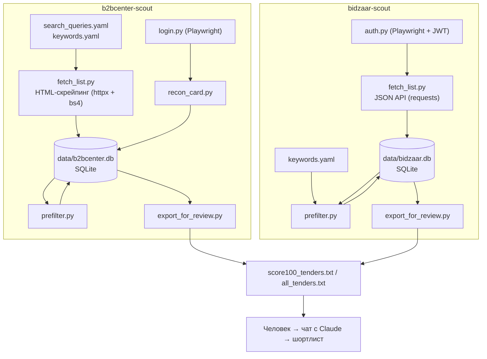
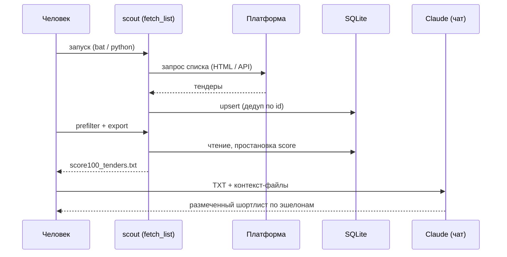

# System Architecture

## System Overview

Две независимые, структурно похожие CLI-системы на Python, реализующие один паттерн обработки: **fetch → store(SQLite) → prefilter → export(TXT) → ручной разбор в чате с Claude**. Различие — транспорт: `b2bcenter-scout` скрейпит HTML, `bidzaar-scout` использует JSON API. Оркестрация — Windows `.bat`-обёртки (в архиве присутствуют только Python; `.bat` упоминаются в документации). Общего кода между конвейерами нет — это два отдельных «слепка» одной идеи.

## Architecture Diagram

## Component Descriptions

### b2bcenter-scout / fetch_list.py
- **Purpose**: обход поиска B2B-Center и парсинг таблицы тендеров.
- **Responsibilities**: построение URL поиска, пагинация `?from=N`, антибот-паузы, защита от шумовых выдач, запись в SQLite.
- **Dependencies**: httpx, beautifulsoup4, lxml, PyYAML.
- **Type**: Application.

### b2bcenter-scout / prefilter.py, export_for_review.py, login.py, recon_card.py, reset_search.py
- **Purpose**: префильтр (score), выгрузка TXT, Playwright-логин, забор карточки, чистка search-данных.
- **Dependencies**: PyYAML; Playwright (login/recon).
- **Type**: Application.

### bidzaar-scout / auth.py
- **Purpose**: аутентификация Bidzaar — разовый ручной логин, далее headless-чтение свежего JWT из localStorage.
- **Responsibilities**: хранение состояния в `playwright_state.json`, кэш токена `token_cache.json`, выдача token + cookies для API-сессии.
- **Dependencies**: playwright.
- **Type**: Application (security-sensitive).

### bidzaar-scout / fetch_list.py, prefilter.py, export_for_review.py
- **Purpose**: синк списка через API, префильтр, выгрузка.
- **Dependencies**: requests, PyYAML.
- **Type**: Application.

## Data Flow

## Integration Points
- **External APIs**: B2B-Center (HTML, неофициально — скрейпинг); Bidzaar (`/api/process/light/...`, официальный JSON).
- **Databases**: две локальные SQLite (`b2bcenter.db`, `bidzaar.db`).
- **Third-party Services**: Claude (claude.ai) — вне кода, ручной шаг; Playwright/Chromium для авторизации.

## Infrastructure Components
- **CDK Stacks**: отсутствуют.
- **Deployment Model**: локальный запуск на машине BD-сотрудника (Windows), `.bat`-кнопки; venv на машину.
- **Networking**: прямой исходящий HTTPS к площадкам; упоминается возможный корпоративный прокси (`HTTPS_PROXY`).
