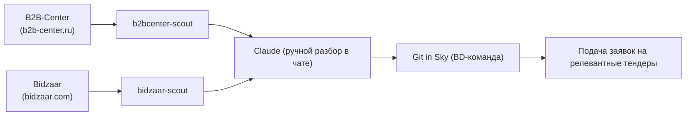

# Business Overview

## Business Context Diagram

## Business Description

- **Business Description**: Система автоматического мониторинга тендерных площадок для компании **Git in Sky (ГИС)** — DevOps / IT-infrastructure консалтинга. Цель — ежедневно вычленять из сотен/тысяч новых тендеров те, что соответствуют профилю услуг ГИС (аудит инфраструктуры, облака/FinOps, отказоустойчивость, ИБ, DR, миграции, поддержка, AI-интеграции), чтобы BD-команда не тратила часы на ручной просмотр карточек.
- **Целевая экономика**: на B2B-Center ~7–8 тыс. лотов/день, целевых — десятки; на Bidzaar ~2700–2900 активных, +100–150 за ночь, кандидатов после префильтра ~6%, реально интересных ~7% от кандидатов. Сплошной ручной обход неэффективен.
- **Текущий «человек в контуре»**: финальный отбор делает человек, отдавая выгруженный TXT в чат с Claude (claude.ai), который размечает кандидатов по эшелонам. «День 2» (автоматический LLM-анализ через API) спроектирован, но **не реализован**.

### Business Transactions

1. **Сбор списка тендеров** — `fetch_list.py` ходит на площадку (HTML-поиск у B2B-Center / JSON API у Bidzaar) и инкрементально складывает тендеры в SQLite.
2. **Префильтрация** — `prefilter.py` проставляет `prefilter_score` (0/50/100) по whitelist/blacklist ключевых слов из YAML.
3. **Выгрузка на разбор** — `export_for_review.py` пишет `all_tenders.txt` и `score100_tenders.txt`.
4. **Ручной семантический разбор** — человек отдаёт TXT (+ контекст-файлы) в чат с Claude; Claude ранжирует по эшелонам ⭐/🟡/🟠/🔴.
5. **Аутентификация (Playwright)** — разовый ручной логин, далее переиспользование сохранённой сессии (для recon у B2B / для всех запросов у Bidzaar).
6. **Recon карточки (только B2B)** — `recon_card.py` забирает полный HTML/скриншот карточки тендера.

### Business Dictionary

- **Тендер / лот / процедура** — закупочная процедура на площадке.
- **Префильтр (prefilter)** — дешёвая фильтрация по ключевым словам до семантического разбора.
- **score100 / кандидат** — тендер, прошедший whitelist (потенциально релевантный).
- **Эшелоны** — ⭐ прямое попадание, 🟡 стоит изучить ТЗ, 🟠 тяжёлая конкуренция, 🔴 шум.
- **GIS-профиль** — перечень услуг, по которым тендер считается релевантным.
- **recon / разведка** — забор полной карточки тендера с авторизацией.
- **День 1 / День 2** — реализованный сбор+префильтр (День 1) против запланированного LLM-анализа (День 2).
- **Утечка префильтра** — релевантный тендер, ошибочно не попавший в score100.

## Component Level Business Descriptions

### b2bcenter-scout
- **Purpose**: мониторинг B2B-Center через встроенный поиск площадки по ~94 ключам.
- **Responsibilities**: HTML-скрейпинг выдачи с антибот-паузами, защита от шумовых выдач (>1000 лотов = фильтр проигнорирован), накопление в SQLite, выгрузка TXT, Playwright-логин и recon карточек.

### bidzaar-scout
- **Purpose**: мониторинг Bidzaar через официальный JSON API.
- **Responsibilities**: Playwright-аутентификация (JWT из localStorage), инкрементальный синк списка, префильтр по keywords.yaml, выгрузка TXT. Зарезервированы поля под День 2 (LLM-анализ).

### Корпус «Данные для анализа»
- **Purpose**: справочные материалы реальных тендеров (7 кейсов: Lamoda ASM/DSP, RFI управление изменениями, Агрохолдинг Просторы, Роквул, МЕДСИ корпоративная шина, КБ Ренессанс, Промсорт виртуализация).
- **Responsibilities**: не код — эталонные примеры ТЗ/КП для калибровки отбора и будущего LLM-анализа.
