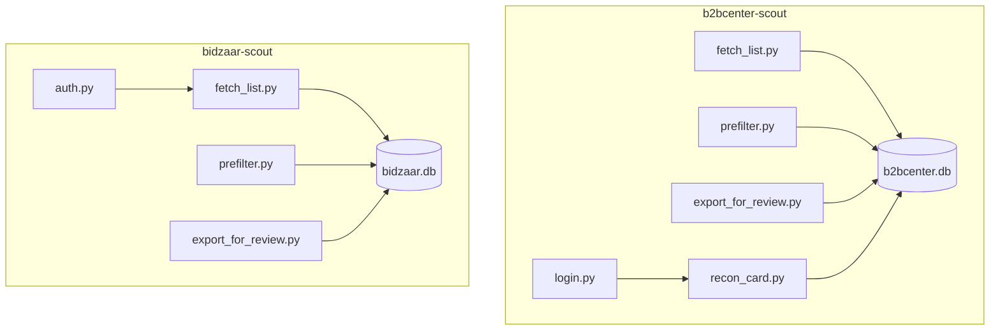

# Dependencies

## Internal Dependencies

### Внутренние связи
- **bidzaar-scout/fetch_list.py → auth.py** — Runtime — берёт токен и cookies (`get_token`, `get_session_cookies`).
- **b2bcenter-scout/recon_card.py → login.py** — Runtime — использует сохранённую Playwright-сессию.
- **prefilter / export → SQLite** — Runtime — общая таблица `tenders` как точка обмена.
- **Между конвейерами связей нет** — два изолированных приложения.

## External Dependencies

### httpx
- **Version**: ≥0.27.0 — **Purpose**: HTTP-клиент B2B-Center — **License**: BSD-3.

### requests
- **Version**: ≥2.31.0 — **Purpose**: HTTP-клиент Bidzaar API — **License**: Apache-2.0.

### beautifulsoup4 / lxml
- **Version**: ≥4.12.0 / ≥5.0.0 — **Purpose**: парсинг HTML B2B-Center — **License**: MIT / BSD.

### PyYAML
- **Version**: ≥6.0 — **Purpose**: чтение словарей ключевых слов/запросов — **License**: MIT.

### playwright
- **Version**: ≥1.40.0 (Bidzaar) / ≥1.45.0 (B2B) — **Purpose**: аутентификация и recon через реальный браузер — **License**: Apache-2.0.

## Замечания
- Версии заданы как нижние границы (`>=`) — нет lock-файла → невоспроизводимые сборки.
- Расхождение минимальной версии playwright между конвейерами (1.40 vs 1.45) — кандидат на унификацию при выделении общего ядра.
- Прямых зависимостей на Anthropic SDK нет (День 2 не реализован).
